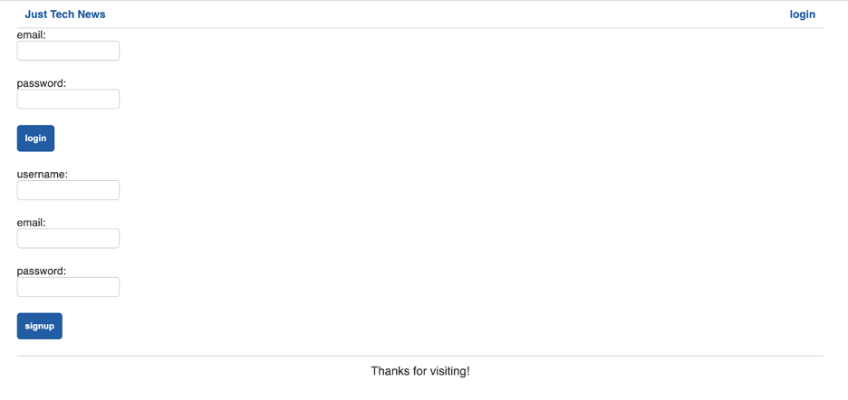
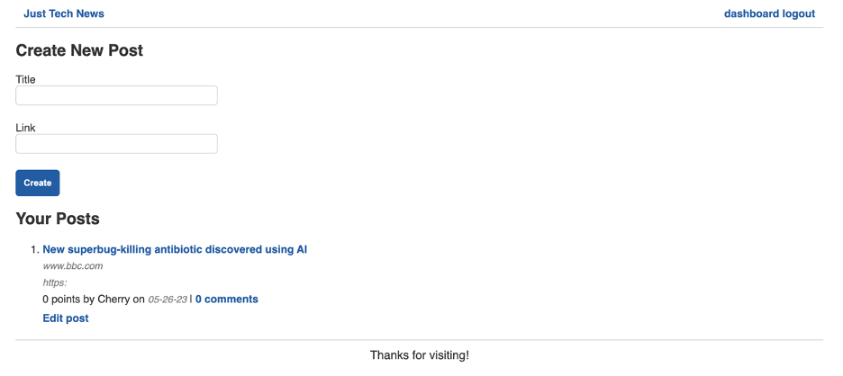
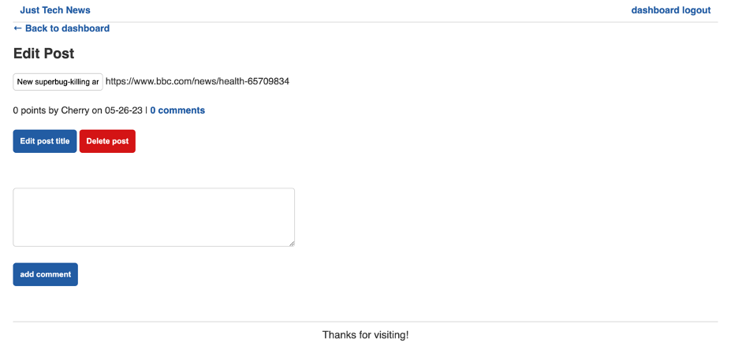
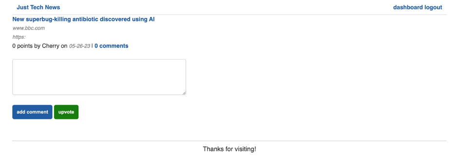

# Just Tech News

## Technology Used 

| Technology Used |                                                             Resource URL                                                             |
| --------------- | :----------------------------------------------------------------------------------------------------------------------------------: |
| Java            |                                     [https://www.oracle.com/java/](https://www.oracle.com/java/)                                     |
| Spring Boot     |                           [https://spring.io/projects/spring-boot](https://spring.io/projects/spring-boot)                           |
| Thymeleaf       |                                       [https://www.thymeleaf.org/](https://www.thymeleaf.org/)                                       |
| Bcrypt          | [https://mvnrepository.com/artifact/org.mindrot.bcrypt/bcrypt/0.3](https://mvnrepository.com/artifact/org.mindrot.bcrypt/bcrypt/0.3) |
| MySQL           |                                           [https://www.mysql.com/](https://www.mysql.com/)                                           |
| Heroku          |                                          [https://www.heroku.com/](https://www.heroku.com/)                                          |

<br/>

## Description 

[Visit the Deployed Site](https://just-tech-news-java.herokuapp.com/)

Just Tech News allows users to post links to news stories related to technology, comment on each others' posts, and upvote (like) posts. For this project, I refactored the back end of an existing application to use Java instead of Node.js, which also required me to rebuild the front end. Specifically, I created MySQL database models and create, read, update, and delete (CRUD) routes. I also created Thymeleaf templates to render the site, along with client-side JavaScript.

<br/>


<br/>

## Code Refactor Example

Here is an example of an API route for creating a post, refactored with Java and Spring Boot.


```java
@PostMapping("/api/posts")
    @ResponseStatus(HttpStatus.CREATED)
    public Post addPost(@RequestBody Post post) {
        repository.save(post);
        return post;
    }
```

<br/>

The following examlple shows part of the post fragment updated for Thymeleaf. Instead of helper functions, Thymeleaf uses conditional statements to transform the data passed to the template before rendering and select which version of the content to render.

```html
<article class="post" th:fragment="post-fragment">
  <div class="title">
    <a th:href="@{ ${post.postUrl} }" target="_blank">[[${post.title}]]</a>

    <div th:if="${#strings.contains(post.postUrl, 'http://')}">
      <div th:with="arg=${#strings.replace(post.postUrl,'http://','')}">
        <div th:if="${#strings.contains(arg, '/')}">
          <div th:with="arg2=${#strings.arraySplit(arg, '/')}">
            <span th:text="${#strings.toString(arg2[0])}"></span>
          </div>
        </div>
        <div th:unless="${#strings.contains(arg, '/')}">
          <div th:if="${#strings.contains(arg, '?')}">
            <div th:with="arg2=${#strings.arraySplit(arg, '?')}">
              <span th:text="${#strings.toString(arg2[0])}"></span>
            </div>
          </div>
          <div th:unless="${#strings.contains(arg, '?')}">
            <span th:text="${#strings.toString(arg)}"></span>
          </div>
        </div>
      </div>
    </div>
```

<br/>

## Usage 

The homepage (see above) shows existing posts, but users must log in before creating or editing a post, commenting, or upvoting. Clicking the ***login*** link at the top of the screen navigates to the Login screen, which offers login and signup forms.



You may sign up or use the following credentials as a visitor:
* **Email**: `test@technews.com`
* **Password**: `Password123`

Logging in takes a user to the Dashboard. Users can view their existing posts and create a new post on the dashboard.



Clicking ***edit post*** allows the user to update the title, add a comment, or delete the post.



By clicking the number of existing comments on a post, a user can view and add comments or upvote the post.



<br/>

## Learning Points 

This project provided some review of Java, but primarily I learned to use the following technologies in order to create a web application in a Java ecosystem:
* Spring Boot for building a server
* Spring Boot as an ORM for MySQL
* Thymeleaf as a template engine

<br/>

## Author Info

### Ryan Moscoe 

* [Portfolio](https://rmoscoe.github.io/my-portfolio/)
* [LinkedIn](https://www.linkedin.com/in/ryan-moscoe-8652973/)
* [Github](https://github.com/rmoscoe)

<br/>

## Credits

Starter code provided by Trilogy Education Services, LLC, a 2U, Inc. brand, on behalf of the University of California, Berkeley Coding Boot Camp.

<br/>

## License

See repository for license information.